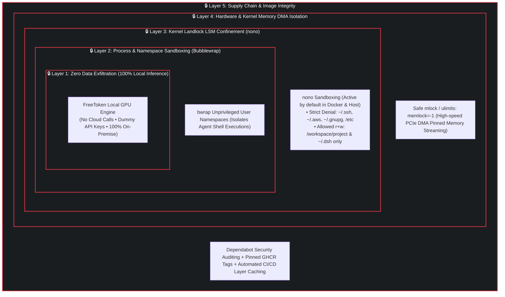
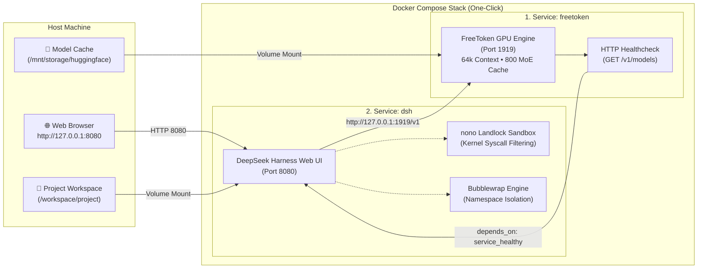

# ⚡ FreeTokenLab

[](https://github.com/abdennebi/FreeTokenLab/actions/workflows/build-publish-ghcr.yml)
[](README.md#-security-first-architecture)
[](https://nono.sh)
[](https://github.com/abdennebi/FreeTokenLab/pkgs/container/freetoken)
[](https://developer.nvidia.com/cuda-toolkit)
[](https://github.com/deepseek-ai/deepseek-harness)
[](https://github.com/abdennebi/FreeTokenLab/security/dependabot)
[](LICENSE)
[](README_FR.md)

**FreeTokenLab** is a **security-first, zero-exfiltration local AI development platform**. It pairs high-performance **35-Billion parameter Mixture-of-Experts (MoE)** inference on consumer hardware (**8 GB VRAM GPUs**) with the **DeepSeek Harness (`dsh`)** autonomous coding agent, shielded by an automatic **5-layer defense-in-depth security architecture**.

> 🇫🇷 *Une documentation complète en français est disponible dans [README_FR.md](README_FR.md).*

---

## 🛡️ Security-First Architecture (5-Layer Defense-in-Depth)

FreeTokenLab is engineered specifically to run autonomous coding agents and LLM tools safely on developers' machines without risk of data exfiltration, secret leakage, or system corruption.



### 1. 🔒 Layer 1: Zero Data Exfiltration (100% Offline AI)
- **Zero External API Calls**: Inferences run entirely on local GPU and Host RAM. No code snippets, prompts, or workspace contents leave your physical machine.
- **Pre-provisioned Dummy Credentials**: Configured with local dummy keys (`dummy-key`) to prevent unintentional calls to public cloud APIs.

### 2. 🛡️ Layer 2: Kernel-Level Landlock LSM Confinement (`nono`)
- **Automatic Kernel Sandboxing**: Whenever you run `docker compose up`, DSH is automatically encapsulated in `nono` (Linux Landlock LSM).
- **Sensitive Path Blacklisting**: Read/write access to host credentials (`~/.ssh`, `~/.aws`, `~/.gnupg`, `~/.bashrc`, `/etc`) is strictly denied at the kernel syscall level.
- **Principle of Least Privilege**: The agent is restricted solely to the active workspace (`/workspace/project`) and local configurations (`~/.dsh`).

### 3. 📦 Layer 3: Process & Namespace Isolation (`Bubblewrap`)
- DeepSeek Harness encapsulates every child shell command and tool execution inside unprivileged **Linux user and mount namespaces** (`bwrap`), preventing container escapes and privilege escalation.

### 4. ⚡ Layer 4: Hardware DMA Protection & Memory Control
- **`ulimits: memlock: -1`**: Dedicated to locking physical RAM buffers for high-speed PCIe Gen3/4 x16 Direct Memory Access (DMA) streaming of un-cached MoE experts, preventing page fault overhead while isolating process memory space.

### 5. 🔄 Layer 5: Automated Supply Chain & Version Pinning
- Pinned image digests, automated weekly Dependabot security scanning, and multi-stage container builds with minimal attack surfaces (Node 22 Bookworm Slim & CUDA Minimal Runtimes).

---

## 🌟 Key Highlights

- **🚀 Instant One-Click Experience**: Launch the inference server and the secured agent Web UI with a single command (`make up`).
- **🧠 35B Parameter MoE on 8 GB VRAM**: Runs **`Ornith-1.5-35B-A3B-NVFP4`** with **65,536 tokens context window** using intelligent MoE expert cache offloading (800 expert slots in VRAM, 256 dynamically streamed).
- **🌐 DeepSeek Harness Web UI**: Full-featured in-browser coding IDE (`http://127.0.0.1:8080`) with chat, session tree, workspace tree, and live diff visualizer.
- **📦 Pre-Built Multi-Arch Images**: No local compilation required; images for `linux/amd64` and `linux/arm64` are pulled directly from GHCR.io.

---

## 🏗️ System Architecture



---

## ⚡ Quick Start (One-Click)

### Prerequisites
- **Linux OS** (x86_64 or ARM64)
- **Docker** & **Docker Compose v2**
- [NVIDIA Container Toolkit](https://docs.nvidia.com/datacenter/cloud-native/container-toolkit/latest/install-guide.html) (Driver >= 550)

### 1. Clone & Launch
```bash
git clone https://github.com/abdennebi/FreeTokenLab.git
cd FreeTokenLab

# Starts both FreeToken and DSH with automatic nono sandboxing
make up
```

### 2. Open Web UI
Open **[http://127.0.0.1:8080](http://127.0.0.1:8080)** in your browser.

### 3. Stop the Stack
```bash
make down
```

---

## 🛠️ Security CLI & Host Workflows

FreeTokenLab supports both Docker Compose and native Landlock host execution:

```bash
# 🔒 Launch native host DSH encapsulated in nono Landlock sandbox
make dsh-secure

# 🛡️ Execute a headless AI task securely on host
make dsh-headless-secure PROMPT="Audit the security of src/auth"

# 📜 Follow real-time logs of the stack
make logs

# 📊 Check container status and health
make ps

# 🔍 Ping the local OpenAI-compatible API
make healthcheck
```

---

## 📊 Security Feature Comparison

| Security Capability | FreeTokenLab (Default) | Standard Local LLM Tools | Cloud LLM Agents |
| :--- | :---: | :---: | :---: |
| **Kernel Landlock LSM (`nono`)** | ✅ **Enforced** | ❌ None | ❌ None |
| **Namespace Sandboxing (`bwrap`)** | ✅ **Enforced** | ❌ Rare | ❌ None |
| **Data Exfiltration Risk** | 🛡️ **Zero (100% Offline)** | ⚠️ Partial | 🚨 High (Cloud API) |
| **Credential Protection (`~/.ssh`)** | 🛡️ **Kernel Blocked** | ❌ Exposed | ⚠️ Risk of leak |
| **DMA Pinned Memory Isolation** | ✅ **Configured (`memlock`)** | ❌ Default unpinned | N/A |
| **Supply Chain Audits (Dependabot)** | ✅ **Automated Weekly** | ❌ Manual | ⚠️ Proprietary |

---

## 📜 License & Acknowledgements

- Licensed under [Apache 2.0](LICENSE).
- Powered by [FreeToken](https://github.com/FlashML-org/FreeToken), [DeepSeek Harness](https://github.com/deepseek-ai/deepseek-harness), and [nono](https://nono.sh).
