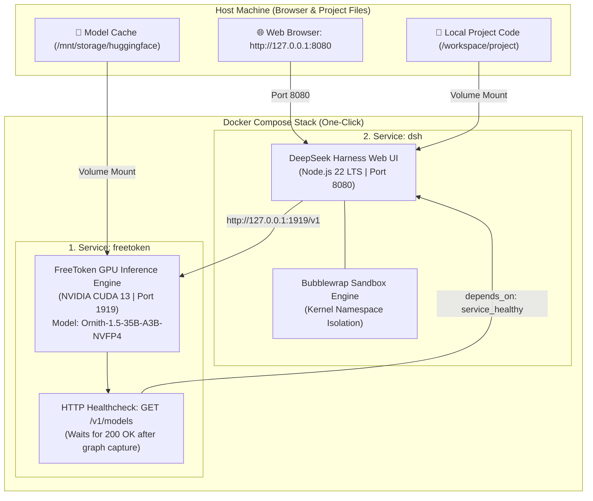

# ⚡ FreeTokenLab

[](https://github.com/abdennebi/FreeTokenLab/actions/workflows/build-publish-ghcr.yml)
[](https://github.com/abdennebi/FreeTokenLab/pkgs/container/freetoken)
[](https://developer.nvidia.com/cuda-toolkit)
[](https://github.com/deepseek-ai/deepseek-harness)
[](LICENSE)
[](README_FR.md)

**FreeTokenLab** is a zero-setup, turnkey local AI development platform. It brings together high-performance **35-billion parameter Mixture-of-Experts (MoE)** inference on consumer-grade hardware (**8 GB VRAM GPUs**) and the **DeepSeek Harness (`dsh`)** Web UI and autonomous coding agent with native **Bubblewrap sandboxing**.

> 🇫🇷 *Une documentation complète en français est disponible dans [README_FR.md](README_FR.md).*

---

## 🌟 Highlights

- **🚀 Instant One-Click Experience**: Launch the entire stack (GPU inference engine + DeepSeek Harness Web UI) with a single command (`make up`).
- **🧠 35B Parameter Models on 8 GB VRAM**: Runs state-of-the-art quantized models (**`Ornith-1.5-35B-A3B-NVFP4`**) via hybrid CPU/GPU MoE offloading (800 expert slots pinned in VRAM, remaining streamed over PCIe).
- **🌐 DeepSeek Harness Web UI**: Full-featured in-browser interface (`http://127.0.0.1:8080`) with chat, live workspace explorer, git diff visualizer, and session management.
- **🔒 Kernel-Level Sandboxing with Bubblewrap (`bwrap`)**: Isolated Linux user/mount namespaces protect your host machine during tool and shell execution.
- **📦 Zero Compilation Needed (Pre-Built GHCR Images)**: Pre-compiled multi-architecture Docker images (`linux/amd64` and `linux/arm64`) are pulled automatically from **GHCR.io**.
- **🔄 Automated Version Pinning & Upstream Sync**: CI workflows monitor upstream FreeToken and DSH releases, automatically building, tagging, and pinning new versions in `docker-compose.yml`.

---

## 🏗️ Architecture



---

## ⚡ Quick Start (One-Click)

### Prerequisites
- **Linux** (x86_64 or ARM64)
- **Docker** & **Docker Compose v2**
- [NVIDIA Container Toolkit](https://docs.nvidia.com/datacenter/cloud-native/container-toolkit/latest/install-guide.html) (NVIDIA Driver >= 550)

### 1. Clone the Repository
```bash
git clone https://github.com/abdennebi/FreeTokenLab.git
cd FreeTokenLab
```

### 2. Launch the Stack
```bash
make up
```
*Docker will pull the pre-built pinned images from GHCR and start:*
1. **FreeToken GPU Server** on `http://127.0.0.1:1919` (waits for expert banks & CUDA graph capture).
2. **DeepSeek Harness Web UI** on `http://127.0.0.1:8080` once the model is healthy.

### 3. Open in Browser
```bash
make open
```
Or open **[http://127.0.0.1:8080](http://127.0.0.1:8080)** directly.

### 4. Stop the Stack
```bash
make down
```

---

## 🤖 DeepSeek Harness (`dsh`) Usage

### 1. Web Interface (GUI)
Access `http://127.0.0.1:8080` for:
- 💬 **Interactive Chat**: High-speed reasoning and code generation powered by Ornith 35B.
- 📂 **Workspace Explorer**: Live directory navigation and file inspection.
- 🔍 **Visual Code Diffs**: Interactive review and approval of code edits before applying them.
- 📜 **Session History**: Resume previous tasks and track token consumption.

### 2. Headless CLI Mode
You can also run batch tasks directly from the terminal:
```bash
# Run a single-shot task inside the container
docker compose exec dsh dsh --profile headless "Analyze src/ and document all public APIs"
```

### 3. Security & Sandboxing (`bubblewrap`)
DeepSeek Harness uses **Bubblewrap (`bwrap`)** to enforce strict filesystem boundaries:
- Host filesystem is mounted in **read-only** mode.
- Modifications are restricted strictly to `/workspace/project` and ephemeral `/tmp`.
- Private PID and `/proc` namespaces prevent subprocesses from inspecting host processes.

---

## 🛠️ Makefile Command Reference

| Command | Description |
| :--- | :--- |
| **`make up`** | 🚀 Launches the full stack (pulls pre-built GHCR images automatically). |
| **`make down`** | 🛑 Stops and removes all running stack containers. |
| **`make open`** | 🌐 Opens the DeepSeek Harness Web UI in your default browser. |
| **`make logs`** | 📜 Streams real-time logs from both `freetoken` and `dsh` containers. |
| **`make ps`** | 📊 Displays current container status and health. |
| **`make pull`** | ⬇️ Pulls the latest pinned images from GHCR.io. |
| **`make healthcheck`** | 🔍 Pings the FreeToken `/v1/models` API endpoint. |
| **`make docker-build-all`** | 🐳 Compiles both Docker images locally from scratch. |
| **`make docker-multiarch`** | 🌍 Builds and pushes multi-architecture images (`amd64` + `arm64`) to GHCR. |
| **`make clean`** | 🧹 Cleans up temporary caches and build artifacts. |

---

## 🌍 Supported Architectures

| Image | Tag | Architectures | Target Platforms |
| :--- | :--- | :--- | :--- |
| `ghcr.io/abdennebi/freetoken` | `v0.1.2` | `linux/amd64`<br>`linux/arm64` | • Intel/AMD x86_64 with NVIDIA RTX GPUs<br>• NVIDIA Grace Hopper (GH200), Jetson Orin, AWS Graviton + GPU |
| `ghcr.io/abdennebi/freetoken-dsh` | `0.1.1-rc.2` | `linux/amd64`<br>`linux/arm64` | • Linux x86_64<br>• Apple Silicon (M1/M2/M3/M4)<br>• Linux ARM64 servers |

---

## 💻 Native Host Installation (Optional without Docker)

If you wish to run directly on the host machine:

```bash
# 1. Install system dependencies, Node.js LTS, and Python venv
./scripts/01_setup_host.sh

# 2. Compile native C++ extensions (_pinned_tensor and _cpu_moe)
./scripts/02_build_freetoken.sh

# 3. Install DeepSeek Harness
npm install -g @deepseek-ai/dsh@0.1.1-rc.2

# 4. Start the inference engine
./scripts/start_server.sh "ornith-ai/Ornith-1.5-35B-A3B-NVFP4" 127.0.0.1 1919

# 5. Start DeepSeek Harness Web UI (in another terminal)
dsh web --port 8080
```

---

## 📄 License & Acknowledgments

- **FreeToken Engine**: Developed by [FlashML-org](https://github.com/FlashML-org/FreeToken).
- **DeepSeek Harness**: Developed by [DeepSeek AI](https://github.com/deepseek-ai/deepseek-harness).
- **FreeTokenLab Suite**: Packaged and automated by [abdennebi](https://github.com/abdennebi).
- Licensed under the **Apache License, Version 2.0**.
