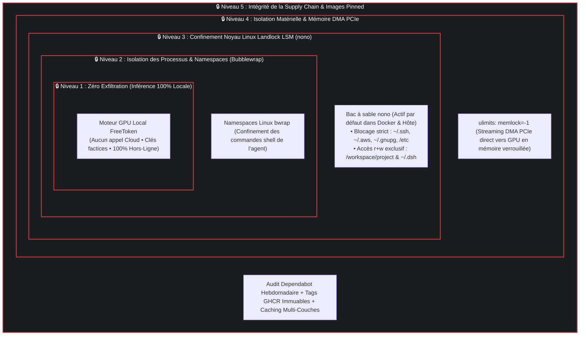
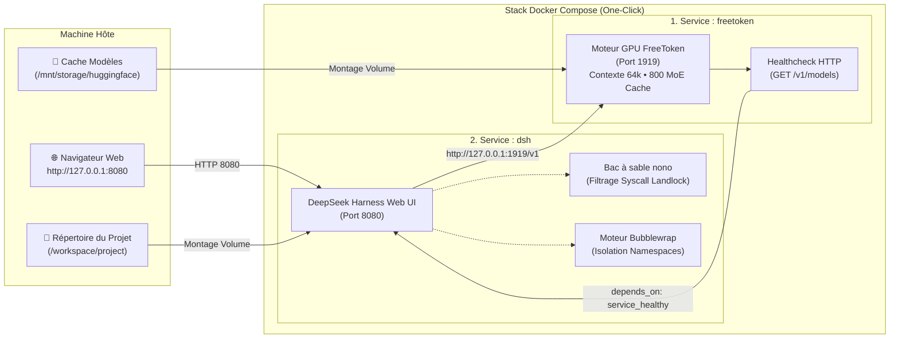

# ⚡ FreeTokenLab — Plateforme IA Locale Sécurisée

[](https://github.com/abdennebi/FreeTokenLab/actions/workflows/build-publish-ghcr.yml)
[](README_FR.md#-architecture-axée-sur-la-sécurité-défense-en-profondeur)
[](https://nono.sh)
[](https://github.com/abdennebi/FreeTokenLab/pkgs/container/freetoken)
[](https://developer.nvidia.com/cuda-toolkit)
[](https://github.com/deepseek-ai/deepseek-harness)
[](https://github.com/abdennebi/FreeTokenLab/security/dependabot)
[](LICENSE)
[](README.md)

**FreeTokenLab** est une plateforme de développement IA locale **conçue avec une approche stricte de sécurité par conception (Security by Design)** et **zéro fuite de données**. Elle associe l'inférence ultra-rapide de modèles **Mixture-of-Experts (MoE) de 35 milliards de paramètres** sur GPU grand public (**8 Go de VRAM**) à l'agent de code autonome **DeepSeek Harness (`dsh`)**, protégé par **5 couches concentriques de sécurité et de sandboxing noyau**.

---

## 🛡️ Architecture Axée sur la Sécurité (Défense en Profondeur)

FreeTokenLab a été spécialement conçu pour permettre aux développeurs d'utiliser des agents autonomes et d'exécuter du code généré par IA sans risquer l'exfiltration de données, le vol de clés secrètes ou la corruption du système hôte.



### 1. 🔒 Niveau 1 : Zéro Exfiltration de Données (Inférence 100% Hors-Ligne)
- **Aucun appel réseau externe** : Les inférences s'exécutent entièrement en local sur votre GPU et votre RAM hôte. Aucun morceau de code, aucun prompt et aucun secret ne quittent votre machine physique.
- **Clés d'API factices pré-provisionnées** : La stack utilise des clés factices (`dummy-key`) locales pour empêcher tout routage involontaire vers des API cloud publiques.

### 2. 🛡️ Niveau 2 : Confinement Noyau Linux Landlock LSM (`nono`)
- **Sandboxing automatique au démarrage** : Dès que vous lancez `docker compose up`, `dsh` est automatiquement encapsulé sous `nono` (Linux Landlock LSM).
- **Protection absolue des secrets hôtes** : L'accès en lecture/écriture à vos dossiers sensibles (`~/.ssh`, `~/.aws`, `~/.gnupg`, `~/.bashrc`, `/etc`) est strictement bloqué au niveau des appels système du noyau Linux.
- **Principe du Moindre Privilège** : L'agent IA n'a de droits d'écriture que sur votre répertoire de projet actif (`/workspace/project`) et sa configuration locale (`~/.dsh`).

### 3. 📦 Niveau 3 : Isolation des Namespaces (`Bubblewrap`)
- DeepSeek Harness encapsule chaque outil shell et exécution de commande dans des **namespaces Linux non privilégiés** (`bwrap`), empêchant tout risque d'élévation de privilèges ou d'évasion de conteneur.

### 4. ⚡ Niveau 4 : Contrôle Matériel DMA & Mémoire Verrouillée (`memlock`)
- **`ulimits: memlock: -1`** : Permet à PyTorch et FreeToken de verrouiller les tampons de RAM physique pour le transfert direct haute vitesse (Direct Memory Access / DMA via PCIe Gen3/4 x16) des experts MoE, éliminant les fautes de page tout en isolant l'espace d'adressage.

### 5. 🔄 Niveau 5 : Sécurité de la Chaîne d'Approvisionnement (Supply Chain)
- Images Docker allégées (Node 22 Bookworm Slim & CUDA Minimal), tags immuables épinglés, et surveillance continue des vulnérabilités de dépendances via **Dependabot**.

---

## 🌟 Points Forts

- **🚀 Expérience One-Click Instantanée** : Démarrage complet de la stack (moteur GPU + Web UI DSH sécurisée) en une seule commande (`make up`).
- **🧠 Modèle MoE 35B sur GPU 8 Go** : Fait tourner **`Ornith-1.5-35B-A3B-NVFP4`** avec un **contexte de 65 536 tokens (64k)** grâce au cache MoE intelligent (800 slots experts en VRAM, streaming dynamique du reste via PCIe).
- **🌐 Interface Web DeepSeek Harness** : Environnement complet dans le navigateur (`http://127.0.0.1:8080`) avec chat interactif, explorateur de fichiers, visualiseur de diffs git et historique de sessions.
- **📦 Images Pré-compilées Multi-Arch** : Aucune compilation locale requise ; les images `linux/amd64` et `linux/arm64` sont téléchargées directement depuis **GHCR.io**.

---

## 🏗️ Schéma Fonctionnel de la Stack



---

## ⚡ Démarrage Rapide

### Prérequis
- **Système Linux** (x86_64 ou ARM64)
- **Docker** et **Docker Compose v2**
- [NVIDIA Container Toolkit](https://docs.nvidia.com/datacenter/cloud-native/container-toolkit/latest/install-guide.html) (Pilotes NVIDIA >= 550)

### 1. Cloner et Lancer
```bash
git clone https://github.com/abdennebi/FreeTokenLab.git
cd FreeTokenLab

# Démarre FreeToken et DSH avec confinement nono automatique
make up
```

### 2. Accéder à l'Interface Web
Ouvrez votre navigateur sur **[http://127.0.0.1:8080](http://127.0.0.1:8080)**.

### 3. Arrêter la Stack
```bash
make down
```

---

## 🛠️ Commandes Disponibles

| Commande | Description |
| :--- | :--- |
| **`make up`** | 🚀 Démarre l'ensemble de la stack (téléchargement automatique des images GHCR). |
| **`make down`** | 🛑 Arrête et supprime les conteneurs de la stack. |
| **`make open`** | 🌐 Ouvre l'interface Web DSH dans le navigateur par défaut. |
| **`make logs`** | 📜 Affiche en direct les logs combinés de `freetoken` et `dsh`. |
| **`make ps`** | 📊 Vérifie l'état de santé des conteneurs. |
| **`make pull`** | ⬇️ Met à jour les images épinglées depuis GHCR.io. |
| **`make dsh-secure`** | 🔒 Lance DSH en natif sur l'hôte sous confinement noyau `nono` (Landlock). |
| **`make dsh-headless-secure`** | 🛡️ Exécute une tâche IA headless sécurisée sur l'hôte via `nono`. |
| **`make healthcheck`** | 🔍 Teste la disponibilité de l'API FreeToken (`/v1/models`). |
| **`make docker-multiarch`** | 🌍 Compile et publie les images multi-architectures (`amd64` + `arm64`). |

---

## 📊 Matrice Comparative de Sécurité

| Fonctionnalité de Sécurité | FreeTokenLab (Par Défaut) | Outils LLM Locaux Standards | Agents LLM Cloud |
| :--- | :---: | :---: | :---: |
| **Filtrage Noyau Landlock LSM (`nono`)** | ✅ **Actif (Systématique)** | ❌ Aucun | ❌ Aucun |
| **Sandboxing Namespaces (`bwrap`)** | ✅ **Actif (Systématique)** | ❌ Rare | ❌ Aucun |
| **Risque d'Exfiltration de Données** | 🛡️ **Zéro (100% Hors-Ligne)** | ⚠️ Partiel | 🚨 Élevé (API Cloud) |
| **Protection des Clés d'Accès (`~/.ssh`)** | 🛡️ **Verrouillé au Noyau** | ❌ Exposé | ⚠️ Risque de fuite |
| **Streaming DMA RAM/GPU (`memlock`)** | ✅ **Optimisé et Isolé** | ❌ Mémoire non verrouillée | N/A |
| **Audit Automatisé des Dépendances** | ✅ **Actif (Dependabot)** | ❌ Manuel | ⚠️ Propriétaire |

---

## 📜 Licence et Remerciements

- Distribué sous licence [Apache 2.0](LICENSE).
- Propulsé par [FreeToken](https://github.com/FlashML-org/FreeToken), [DeepSeek Harness](https://github.com/deepseek-ai/deepseek-harness) et [nono](https://nono.sh).
