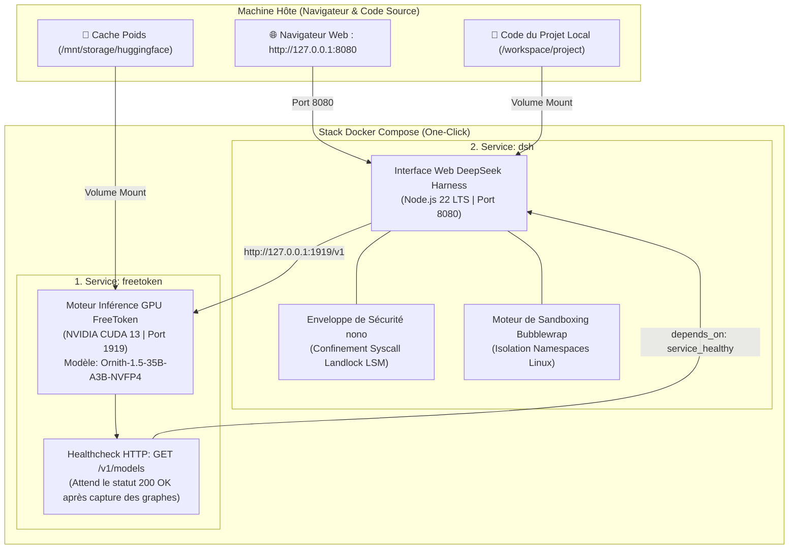

# ⚡ FreeTokenLab (Documentation en Français)

> 🇬🇧 *An English version of this documentation is available in [README.md](README.md).*

[](https://github.com/abdennebi/FreeTokenLab/actions/workflows/build-publish-ghcr.yml)
[](https://github.com/abdennebi/FreeTokenLab/pkgs/container/freetoken)
[](https://developer.nvidia.com/cuda-toolkit)
[](https://nono.sh)
[](https://github.com/deepseek-ai/deepseek-harness)
[](https://github.com/abdennebi/FreeTokenLab/security/dependabot)
[](LICENSE)

**FreeTokenLab** est un environnement clé en main permettant d'exécuter localement des modèles **Mixture-of-Experts (MoE) de 35 milliards de paramètres** sur des cartes graphiques grand public (**8 Go de VRAM**) couplé à l'interface et agent de code autonome **DeepSeek Harness (`dsh`)** avec **double couche de confinement noyau (`nono` + `Bubblewrap`)**.

---

## 🌟 Points Forts

- **🚀 Expérience "One-Click" Immédiate** : Démarrage simultané du moteur d'inférence GPU et de l'interface Web DeepSeek Harness en 1 commande (`make up`).
- **🧠 Modèle 35B sur GPU 8 Go** : Inférence hybride CPU/GPU avec quantification NVFP4 (**`Ornith-1.5-35B-A3B-NVFP4`**), 800 experts en cache VRAM et streaming PCIe asynchrone.
- **🌐 Interface Web DeepSeek Harness** : Interface graphique complète dans le navigateur (`http://127.0.0.1:8080`) avec chat interactif, explorateur de code, visualiseur de diffs git et gestion de sessions.
- **🛡️ Double Barrière de Sécurité Noyau (`nono` + `Bubblewrap`)** :
  - **`nono` (Landlock LSM)** : Confinement strict au niveau des appels système, protection automatique des clés et identifiants sensibles (`~/.ssh`, `~/.aws`, `~/.gnupg`) et blocage des commandes destructives.
  - **`Bubblewrap`** : Isolation des namespaces de montage et d'utilisateurs Linux pour les sous-commandes de l'agent.
- **📦 Zéro Compilation Locale (Images GHCR Préconstruites)** : Images Docker multi-architectures (`linux/amd64` et `linux/arm64`) téléchargées automatiquement depuis **GHCR.io**.
- **🔄 Épinglage Automatique des Versions** : Les workflows CI surveillent les releases officielles de FreeToken et DSH, compilent et épinglent automatiquement les versions exactes dans `docker-compose.yml`.

---

## 🏗️ Architecture de la Stack



---

## ⚡ Démarrage Rapide ("One-Click")

### Prérequis
- **Linux** (x86_64 ou ARM64)
- **Docker** et **Docker Compose v2**
- [NVIDIA Container Toolkit](https://docs.nvidia.com/datacenter/cloud-native/container-toolkit/latest/install-guide.html) (Pilote NVIDIA >= 550)

### 1. Cloner le Dépôt
```bash
git clone https://github.com/abdennebi/FreeTokenLab.git
cd FreeTokenLab
```

### 2. Lancer la Stack
```bash
make up
```
*Docker télécharge automatiquement les images précompilées depuis GHCR et démarre :*
1. **FreeToken GPU** sur `http://127.0.0.1:1919` (charge les 256 experts et capture les graphes CUDA).
2. **DeepSeek Harness Web** sur `http://127.0.0.1:8080` dès que le modèle est prêt.

### 3. Ouvrir dans le Navigateur
```bash
make open
```
Ou rendez-vous directement sur **[http://127.0.0.1:8080](http://127.0.0.1:8080)**.

### 4. Arrêter la Stack
```bash
make down
```

---

## 🔒 Sécurité et Confinement (`nono` + `bubblewrap`)

FreeTokenLab implémente une sécurité en profondeur :
1. **`nono` (Landlock LSM)** :
   - Bloque au niveau du noyau l'accès aux identifiants et secrets de la machine hôte (`~/.ssh`, `~/.aws`, `~/.gnupg`, `~/.bashrc`, `/etc`).
   - Baisse irréversible des privilèges au premier appel système.
   - Empêche les commandes destructives (`rm -rf /`, `chmod 777`).
2. **`Bubblewrap` (`bwrap`)** :
   - Cantonne les modifications de l'agent au dossier du projet et au `/tmp` éphémère.

### Lancer DSH en natif sécurisé avec `nono` :
```bash
# Démarrer DSH Web sous protection Landlock nono
make dsh-secure

# Exécuter une commande headless sécurisée
make dsh-headless-secure PROMPT="Analyse la sécurité du module auth"
```

---

## 🛠️ Commandes du Makefile

| Commande | Description |
| :--- | :--- |
| **`make up`** | 🚀 Démarre la stack complète (téléchargement automatique des images GHCR). |
| **`make down`** | 🛑 Arrête et nettoie l'ensemble des conteneurs. |
| **`make open`** | 🌐 Ouvre l'interface Web DSH dans votre navigateur par défaut. |
| **`make logs`** | 📜 Affiche les logs en direct des conteneurs `freetoken` et `dsh`. |
| **`make ps`** | 📊 Affiche l'état et la santé des conteneurs. |
| **`make pull`** | ⬇️ Télécharge les dernières images épinglées depuis GHCR.io. |
| **`make dsh-secure`** | 🔒 Démarre DSH Web en natif sous confinement `nono` (Landlock). |
| **`make dsh-headless-secure`** | 🛡️ Exécute une tâche headless isolée avec `nono`. |
| **`make healthcheck`** | 🔍 Vérifie la disponibilité de l'API FreeToken `/v1/models`. |
| **`make docker-build-all`** | 🐳 Compile localement les images Docker depuis les sources. |
| **`make docker-multiarch`** | 🌍 Compile et pousse les images Multi-Arch (`amd64` + `arm64`) vers GHCR. |
| **`make clean`** | 🧹 Nettoie les caches temporaires et fichiers de build. |

---

## 🌍 Architectures Supportées

| Image | Tag | Architectures | Cibles Matérielles |
| :--- | :--- | :--- | :--- |
| `ghcr.io/abdennebi/freetoken` | `v0.1.2` | `linux/amd64`<br>`linux/arm64` | • PC / Serveurs Intel/AMD x86_64 avec GPU NVIDIA RTX<br>• NVIDIA Grace Hopper (GH200), Jetson Orin, AWS Graviton + GPU |
| `ghcr.io/abdennebi/freetoken-dsh` | `0.1.1-rc.2` | `linux/amd64`<br>`linux/arm64` | • Linux x86_64<br>• Apple Silicon (M1/M2/M3/M4)<br>• Serveurs Linux ARM64 |

---

## 💻 Installation Native sur l'Hôte (Optionnel sans Docker)

Si vous préférez exécuter directement sur la machine hôte :

```bash
# 1. Installer les dépendances système, Node.js LTS, nono et Python venv
./scripts/01_setup_host.sh

# 2. Compiler les extensions C++ natives FreeToken (_pinned_tensor et _cpu_moe)
./scripts/02_build_freetoken.sh

# 3. Installer DeepSeek Harness
npm install -g @deepseek-ai/dsh@0.1.1-rc.2

# 4. Démarrer le serveur d'inférence
./scripts/start_server.sh "ornith-ai/Ornith-1.5-35B-A3B-NVFP4" 127.0.0.1 1919

# 5. Démarrer l'interface Web DSH sous confinement nono (dans un autre terminal)
./scripts/dsh_secure.sh web --port 8080
```

---

## 📄 Licence & Remerciements

- **Moteur FreeToken** : Développé par [FlashML-org](https://github.com/FlashML-org/FreeToken).
- **DeepSeek Harness** : Développé par [DeepSeek AI](https://github.com/deepseek-ai/deepseek-harness).
- **Sandbox nono** : Développé par [nolabs](https://nono.sh).
- **Suite FreeTokenLab** : Industrialisation et packaging par [abdennebi](https://github.com/abdennebi).
- Sous licence **Apache License, Version 2.0**.
